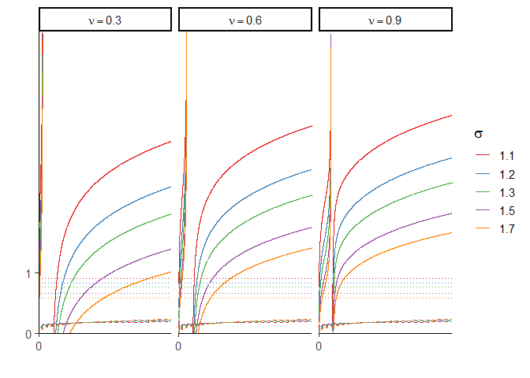

Equilibrium Uniqueness
================
Fabien Petit
17/06/2019

This notebook refers to the Appendix **“Uniqueness of the equilibrium”**
in the paper.

``` r
# Load packages
packages <- c("dplyr", "ggplot2", "ggrepel", "RColorBrewer", "reshape2", "extrafont")
lapply(packages, require, character.only = TRUE)
```

    ## Loading required package: dplyr

    ## 
    ## Attaching package: 'dplyr'

    ## The following objects are masked from 'package:stats':
    ## 
    ##     filter, lag

    ## The following objects are masked from 'package:base':
    ## 
    ##     intersect, setdiff, setequal, union

    ## Loading required package: ggplot2

    ## Loading required package: ggrepel

    ## Loading required package: RColorBrewer

    ## Loading required package: reshape2

    ## Loading required package: extrafont

    ## Registering fonts with R

``` r
rm(packages)

# Define paths
loc_shape = file.path(getwd(), "result", "shape")
# Graphic parameter
scale_graph = 1920/1080
red = brewer.pal(8, "Set1")[1]
```

## Shapes of the \(g\) function

The g function has four different shapes according to the value of
\(\sigma\) and both vertical asymptotes (\(k_1\) and \(k_2\)).

``` r
g = function(k, sigma, ks){
  
  k1 = ks[1]
  k2 = ks[2]
  
  G = log((k/k1-1)/((k/k2)^((sigma-1)/sigma)-1))
  return(G)
}
```

``` r
# Create a dataframe with only x values
df = data.frame("inter" = seq(0, 10, length.out = 10000))

# 4 cases
sigmas = c(0.8, 1.2)
ks = list(c(1, 2), c(2,1))

# Generate g function for each cases
df = df %>% 
  mutate(g1 = g(inter, sigmas[1], ks[[1]]),
         g2 = g(inter, sigmas[1], ks[[2]]),
         g3 = g(inter, sigmas[2], ks[[1]]),
         g4 = g(inter, sigmas[2], ks[[2]])) %>% 
  melt(id.vars = "inter")
```

``` r
df %>%
  subset(variable == "g1") %>% 
  
  ggplot(aes(x = inter, y = value)) +
  geom_hline(yintercept = 0) +
  geom_line(color = red) +
  # Dashed lines (specific values)
  geom_vline(xintercept = 1, color = red, linetype = "dashed", alpha = 0.5) +
  geom_vline(xintercept = 2, color = red, linetype = "dashed", alpha = 0.5) +
  # Axis
  scale_x_continuous(name = "", breaks = c(0, 1, 2), labels = c(0, expression(k[1]), expression(k[2])),
                     limits = c(0,3), expand = c(0,0)) + 
  scale_y_continuous(name = "", breaks = 0, labels = 0,
                      limits = c(-1.5,3.5), expand = c(0,0)) +
  # Graphic background
  theme_classic(base_size = 14) +
  theme(axis.line.x = element_blank(),
        axis.ticks.x = element_blank()) +
  # Save
  ggsave(file.path(loc_shape, "function_g", "graph_a.png"), width = 7, height = 7*2/3)
```

<!-- -->

### Case b)

``` r
df %>%
  subset(variable == "g2") %>% 
  
  ggplot(aes(x = inter, y = value)) +
  geom_line(color = red) +
  geom_hline(yintercept = 0) +
  # Dashed lines (specific values)
  geom_vline(xintercept = 1, color = red, linetype = "longdash", alpha = 0.5) +
  geom_vline(xintercept = 2, color = red, linetype = "longdash", alpha = 0.5) +
  # Axis
  scale_x_continuous(name = "", breaks = c(0, 1, 2), labels = c(0, expression(k[2]), expression(k[1])),
                     limits = c(0,3), expand = c(0,0)) + 
  scale_y_continuous(name = "", breaks = 0, labels = 0,
                      limits = c(-1.5,3.5), expand = c(0,0)) +
  # Graphic background
  theme_classic(base_size = 14) +
  theme(axis.line.x = element_blank(),
        axis.ticks.x = element_blank()) +
  # Save
  ggsave(file.path(loc_shape, "function_g", "graph_b.png"), width = 7, height = 7*2/3)
```

<!-- -->

### Case c)

``` r
df %>%
  subset(variable == "g3") %>% 
  
  ggplot(aes(x = inter, y = value)) +
  geom_line(color = red) +
  geom_hline(yintercept = 0) +
  # Dashed lines (specific values)
  geom_vline(xintercept = 1, color = red, linetype = "longdash", alpha = 0.5) +
  geom_vline(xintercept = 2, color = red, linetype = "longdash", alpha = 0.5) +
  # Axis
  scale_x_continuous(name = "", breaks = c(0, 1, 2), labels = c(0, expression(k[1]), expression(k[2])),
                     limits = c(0,7), expand = c(0,0)) + 
  scale_y_continuous(name = "", breaks = 0, labels = 0,
                      limits = c(-2,5), expand = c(0,0)) +
  # Graphic background
  coord_cartesian() + 
  theme_classic(base_size = 14) +
  theme(axis.line.x = element_blank(),
        axis.ticks.x = element_blank()) +
  # Save
  ggsave(file.path(loc_shape, "function_g", "graph_c.png"), width = 7, height = 7*2/3)
```

<!-- -->

### Case d)

``` r
df %>%
  subset(variable == "g4") %>% 
  
  ggplot(aes(x = inter, y = value)) +
  geom_line(color = red) +
  geom_hline(yintercept = 0) +
  # Dashed lines (specific values)
  geom_vline(xintercept = 1, color = red, linetype = "longdash", alpha = 0.5) +
  geom_vline(xintercept = 2, color = red, linetype = "longdash", alpha = 0.5) +
  # Axis
  scale_x_continuous(name = "", breaks = c(0, 1, 2), labels = c(0, expression(k[2]), expression(k[1])),
                     limits = c(0,7), expand = c(0,0)) + 
  scale_y_continuous(name = "", breaks = 0, labels = 0,
                      limits = c(-2,5), expand = c(0,0)) +
  # Graphic background
  coord_cartesian() + 
  theme_classic(base_size = 14) +
  theme(axis.line.x = element_blank(),
        axis.ticks.x = element_blank()) +
  # Save
  ggsave(file.path(loc_shape, "function_g", "graph_d.png"), width = 7, height = 7*2/3)
```

<!-- -->

## h function

``` r
# Interval vector
inter = seq(0.001, 100, by = 0.001)

# 3 cases
sigmas = c(0.25, 0.8, 1.2)
phi = 0.3 # Average value of phi for France and the United-States
gamma = 0.5 # Value from calibration

# Empty data frame
df = data.frame(matrix(ncol = 3, nrow = 0)) %>% 
  setNames(c("inter", "sigma", "value"))

# Loop
for(i in c(1:3)){
    
    df = cbind(inter, "sigma" = sigmas[i], "value" = h(inter, sigmas[i], phi, gamma)) %>% 
      as.data.frame() %>% 
      rbind(df)
    
}
```

``` r
# Value of sigma in this case
sigma_1 = 0.25

# Generate the graph
df %>% 
  subset(sigma == 0.25) %>% 
  
  ggplot(aes(x = inter, y = value)) +
  geom_line(color = red) +
  # Dashed line for the horizontal asymptote
  geom_hline(yintercept = 1/sigma_1, linetype = "dashed", color = red, alpha = 0.5) +
  # Axis
  scale_x_continuous(name = "", breaks = 0, labels = 0, limits = c(0, 1.5), expand = c(0,0)) +
  scale_y_continuous(name = "", breaks = c(0, 1/sigma_1), labels = c(0, expression(frac(1,sigma))),
                     limits = c(0, 1/sigma_1*1.05), expand = c(0,0)) +
  # Graphic background
  theme_classic(base_size = 14) +
  # Save
  ggsave(file.path(loc_shape, "function_h", "graph_1.png"), width = 5, height = 5)
```

<!-- -->

``` r
# Value of sigma in this case
sigma_2 = 0.8

# Generate the graph
df %>% 
  subset(sigma == sigma_2) %>% 
  
  ggplot(aes(x = inter, y = value)) +
  geom_line(color = red) +
  # Dashed line for the horizontal asymptote
  geom_hline(yintercept = 1/sigma_2, linetype = "dashed", color = red, alpha = 0.5) +
  # Axis
  scale_x_continuous(name = "", breaks = 0, labels = 0, limits = c(0, 1.5), expand = c(0,0)) +
  scale_y_continuous(name = "", breaks = c(0, 1/sigma_2), labels = c(0, expression(frac(1,sigma))),
                     limits = c(0, 1/sigma_2*1.05), expand = c(0,0)) +
  # Graphic background
  theme_classic(base_size = 14) +
  # Save
  ggsave(file.path(loc_shape, "function_h", "graph_2.png"), width = 5, height = 5)
```

<!-- -->

``` r
# Value of sigma in this case
sigma_3 = 1.2

# Generate the graph
df %>% 
  subset(sigma == sigma_3) %>% 
  
  ggplot(aes(x = inter, y = value)) +
  geom_line(color = red) +
  # Dashed line for the horizontal asymptote
  geom_hline(yintercept = 1/sigma_3, linetype = "dashed", color = red, alpha = 0.5) +
  # Axis
  scale_x_continuous(name = "", breaks = 0, labels = 0, limits = c(0, 1.5), expand = c(0,0)) +
  scale_y_continuous(name = "",
                     breaks = c(0, 1/sigma_3), labels = c(0, expression(frac(1,sigma))),
                     limits = c(0, 1/sigma_3*1.05), expand = c(0,0)) +
  # Graphic background
  theme_classic(base_size = 14) +
  # Save
  ggsave(file.path(loc_shape, "function_h", "graph_3.png"), width = 5, height = 5)
```

<!-- -->

## Uniqueness of the equilibrium in case c)

``` r
# Ranges
sigma_range = c(1.1, 1.2, 1.3, 1.5, 1.7)
k1 = 1
k2_range = k1*c(1.1, 3, 5)
gamma = 0.5
phi = 0.3

# Interval
inter = seq(0.001, 30, 0.001)

# Empty data frame
result = data.frame(matrix(ncol = 4, nrow = 0)) %>% 
  setNames(c("inter", "sigma", "k2", "value"))

# Loop to compute g function
for(k2 in k2_range){
  for(sigma in sigma_range){
   
   g = function(k, sigma, k1, k2){
      G = log((k/k1-1)/((k/k2)^((sigma-1)/sigma)-1))
      return(G)
   }
   
   h = function(k, sigma, k1, phi, gamma){
     H = (sigma + (1-phi)/phi*(1-gamma*(1-sigma))/gamma*k^((1-sigma)/sigma))^(-1)
     return(H)
   }
   
   result = cbind(inter, sigma, k2, "value" = g(inter, sigma, k1, k2),
                  "value_h" = h(inter, sigma, k1, phi, gamma)) %>% 
     rbind(result)
   
  }
}

result = as.data.frame(result)

# Compute bound and violation as a logic variable
result = result %>% 
  # subset(inter > k2) %>% 
   mutate(bound = 1/as.numeric(as.character(sigma)),
          violation = ifelse(bound > value, TRUE, FALSE),
          sigma = as.factor(sigma),
          k2 = as.factor(k2))

# Values for all k > k2
result_after = result %>% 
  subset(inter > as.numeric(as.character(k2)))

# Values for all k<= k2
result_before = result %>% 
  subset(inter <= as.numeric(as.character(k2)))

# Check if g and h intersect
sum(result_after$violation, na.rm = TRUE) # If =  0, then do not intersect after k2
```

    ## [1] 0

``` r
# Show minimum k on (k2, +infinity)
min_val = result_after %>%  
  group_by(sigma, k2) %>% 
  summarise(min(value), min(bound)) %>% 
  setNames(c("sigma", "k2", "min_k", "min_x"))
min_val
```

    ## # A tibble: 15 x 4
    ## # Groups:   sigma [5]
    ##    sigma k2    min_k min_x
    ##    <fct> <fct> <dbl> <dbl>
    ##  1 1.1   1.1    2.85 0.909
    ##  2 1.1   3      4.32 0.909
    ##  3 1.1   5      4.88 0.909
    ##  4 1.2   1.1    2.23 0.833
    ##  5 1.2   3      3.67 0.833
    ##  6 1.2   5      4.24 0.833
    ##  7 1.3   1.1    1.89 0.769
    ##  8 1.3   3      3.32 0.769
    ##  9 1.3   5      3.88 0.769
    ## 10 1.5   1.1    1.50 0.667
    ## 11 1.5   3      2.89 0.667
    ## 12 1.5   5      3.45 0.667
    ## 13 1.7   1.1    1.27 0.588
    ## 14 1.7   3      2.64 0.588
    ## 15 1.7   5      3.20 0.588

``` r
# Pull the minimum value of X for each possible couples (sigma, k2)
x_bound = min_val %>% pull("min_x")

# Generate
result_after %>%  
  
  ggplot(aes(x = inter, y = value)) +
  geom_line(aes(color = sigma)) +
  # Limit in +infinity of the h function
  geom_hline(data = min_val, aes(yintercept = x_bound, color = sigma), linetype = "dashed") +
  # Wrap
  facet_wrap(k2 ~ ., labeller = label_bquote(nu == .(as.numeric(as.character(k2))))) +
  # Axis
  scale_x_continuous(breaks = 0, limits = c(0, 10), expand = c(0,0)) +
  scale_y_continuous(breaks = c(0,1), limits = c(0, 5), expand = c(0,0)) +
  # Graphic parameters
  scale_color_manual(name = bquote(sigma), values = brewer.pal(8, "Set1")) +
  theme_classic(base_size = 14) +
  theme(legend.position = "right") +
  labs(x = "", y = "") +
  # Save
  ggsave(file.path(loc_shape, "uniqueness", "gc_after.png"), width = scale_graph*5, height = scale_graph*5/3)
```

<!-- -->

``` r
result_before %>% 
  
  ggplot(aes(x = inter, y = value)) +
  geom_line(aes(color = sigma)) +
  # Limit in +infinity of the h function (not very useful on this graph)
  geom_hline(data = min_val, aes(yintercept = x_bound, color = sigma), linetype = "dashed") +
  # Wrap
  facet_wrap(k2 ~ ., labeller = label_bquote(nu == .(as.numeric(as.character(k2))))) +
  # Axis
  scale_x_continuous(breaks = c(0,1), limits = c(0, 1), expand = c(0,0)) +
  scale_y_continuous(breaks = c(0,1), limits = c(0, 2), expand = c(0,0)) +
  # Graphic parameters
  scale_color_manual(name = bquote(sigma), values = brewer.pal(8, "Set1")) +
  theme_classic(base_size = 14) +
  theme(legend.position = "right") +
  labs(x = "", y = "") +
  # Save
  ggsave(file.path(loc_shape, "uniqueness", "gc_before.png"), width = scale_graph*5, height = scale_graph*5/3)
```

<!-- -->

``` r
result_before %>% 
  
  ggplot(aes(x = inter, color = sigma)) +
  # g function
  geom_line(aes(y = value)) +
  # h function
  geom_line(aes(y = value_h), linetype = "dashed") +
  # Limit in +infinity of the h function
  geom_hline(data = min_val, aes(yintercept = x_bound, color = sigma), linetype = "dotted") +
  # Wrap
  facet_wrap(k2 ~ ., labeller = label_bquote(nu == .(as.numeric(as.character(k2))))) +
  # Axis
  scale_x_continuous(breaks = c(0,1), limits = c(0, 1), expand = c(0,0)) +
  scale_y_continuous(breaks = c(0,1), limits = c(0, 2), expand = c(0,0)) +
  # Graphic parameters
  scale_color_manual(name = bquote(sigma), values = brewer.pal(8, "Set1")) +
  theme_classic(base_size = 14) +
  theme(legend.position = "right") +
  labs(x = "", y = "") +
  # Save
  ggsave(file.path(loc_shape, "uniqueness", "gc_before_all.png"), width = scale_graph*5, height = scale_graph*5/3)
```

<!-- -->

``` r
result %>% 
  
  ggplot(aes(x = inter, color = sigma)) +
  # g function
  geom_line(aes(y = value)) +
  # h function
  geom_line(aes(y = value_h), linetype = "dashed") +
  # Limit in +infinity of the h function
  geom_hline(data = min_val, aes(yintercept = x_bound, color = sigma), linetype = "dotted") +
  # Wrap
  facet_wrap(k2 ~ ., labeller = label_bquote(nu == .(as.numeric(as.character(k2))))) +
  # Axis
  scale_x_continuous(breaks = 0, limits = c(0, 10), expand = c(0,0)) +
  scale_y_continuous(breaks = c(0,1), limits = c(0, 5), expand = c(0,0)) +
  # Graphic parameters
  scale_color_manual(name = bquote(sigma), values = brewer.pal(8, "Set1")) +
  theme_classic(base_size = 14) +
  theme(legend.position = "right") +
  labs(x = "", y = "") +
  # Save
  ggsave(file.path(loc_shape, "uniqueness", "gc_all.png"), width = scale_graph*5, height = scale_graph*5/3)
```

<!-- -->

## Uniqueness of the equilibrium in case d)

``` r
# Ranges
sigma_range = c(1.1, 1.2, 1.3, 1.5, 1.7)
k1 = 1
k2_range = k1*c(0.3, 0.6, 0.9)
gamma = 0.5
phi = 0.3

# Interval
inter = seq(0.001, 30, 0.001)

# Empty data frame
result = data.frame(matrix(ncol = 4, nrow = 0)) %>% 
  setNames(c("inter", "sigma", "k2", "value"))

# Loop to compute g function
for(k2 in k2_range){
  for(sigma in sigma_range){
   
   g = function(k, sigma, k1, k2){
      G = log((k/k1-1)/((k/k2)^((sigma-1)/sigma)-1))
      return(G)
   }
   
   h = function(k, sigma, k1, phi, gamma){
     H = (sigma + (1-phi)/phi*(1-gamma*(1-sigma))/gamma*k^((1-sigma)/sigma))^(-1)
     return(H)
   }
   
   result = cbind(inter, sigma, k2, "value" = g(inter, sigma, k1, k2),
                  "value_h" = h(inter, sigma, k1, phi, gamma)) %>% 
     rbind(result)
   
  }
}

result = as.data.frame(result)

# Compute bound and violation logic
result = result %>% 
  # subset(inter > k2) %>% 
   mutate(bound = 1/as.numeric(as.character(sigma)),
          violation = ifelse(bound > value, TRUE, FALSE),
          h_over_g = ifelse(value < value_h, TRUE, FALSE),
          sigma = as.factor(sigma),
          k2 = as.factor(k2))

result_after = result %>% 
  subset(inter > as.numeric(as.character(k2)))

result_before = result %>% 
  subset(inter <= as.numeric(as.character(k2)))

# Check if g and h intersect
sum(result_after$h_over_g, na.rm = TRUE) # If =  0, then do not intersect after k2
```

    ## [1] 5438

``` r
# Show minimum k on (k2, +infinity)
min_val = result_after %>%  
  group_by(sigma, k2) %>% 
  summarise(min(value), min(bound)) %>% 
  setNames(c("sigma", "k2", "min_k", "min_x"))
min_val
```

    ## # A tibble: 15 x 4
    ## # Groups:   sigma [5]
    ##    sigma k2    min_k min_x
    ##    <fct> <fct> <dbl> <dbl>
    ##  1 1.1   0.3     NaN 0.909
    ##  2 1.1   0.6     NaN 0.909
    ##  3 1.1   0.9     NaN 0.909
    ##  4 1.2   0.3     NaN 0.833
    ##  5 1.2   0.6     NaN 0.833
    ##  6 1.2   0.9     NaN 0.833
    ##  7 1.3   0.3     NaN 0.769
    ##  8 1.3   0.6     NaN 0.769
    ##  9 1.3   0.9     NaN 0.769
    ## 10 1.5   0.3     NaN 0.667
    ## 11 1.5   0.6     NaN 0.667
    ## 12 1.5   0.9     NaN 0.667
    ## 13 1.7   0.3     NaN 0.588
    ## 14 1.7   0.6     NaN 0.588
    ## 15 1.7   0.9     NaN 0.588

``` r
x_bound = min_val %>% pull("min_x")
```

``` r
result %>% 
  
  ggplot(aes(x = inter, color = sigma)) +
  # g function
  geom_line(aes(y = value)) +
  # h function
  geom_line(aes(y = value_h), linetype = "dashed") +
  # Limit in +infinity of the h function
  geom_hline(data = min_val, aes(yintercept = x_bound, color = sigma), linetype = "dotted") +
  # Wrap
  facet_wrap(k2 ~ ., labeller = label_bquote(nu == .(as.numeric(as.character(k2))))) +
  # Axis
  scale_x_continuous(breaks = 0, limits = c(0, 10), expand = c(0,0)) +
  scale_y_continuous(breaks = c(0,1), limits = c(0, 5), expand = c(0,0)) +
  # Graphic parameters
  scale_color_manual(name = bquote(sigma), values = brewer.pal(8, "Set1")) +
  theme_classic(base_size = 14) +
  theme(legend.position = "right") +
  labs(x = "", y = "") +
  # Save
  ggsave(file.path(loc_shape, "uniqueness", "gd_all.png"), width = scale_graph*5, height = scale_graph*5/3)
```

<!-- -->
