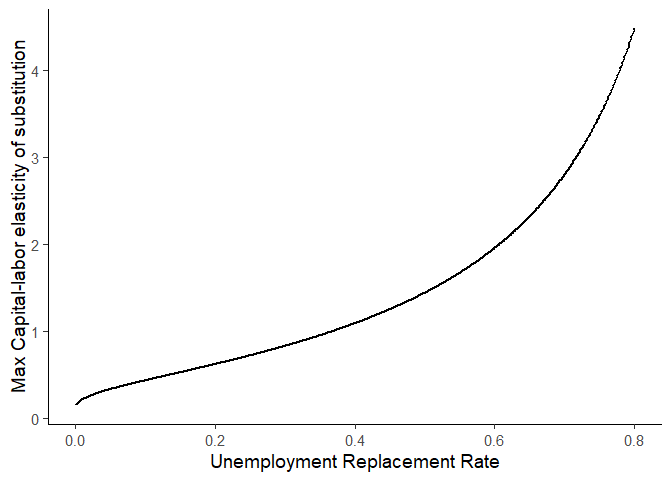
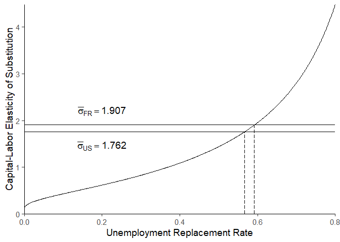

X & Sigma condition
================
Fabien Petit
11/06/2019

``` r
# Load packages
packages <- c("dplyr", "ggplot2", "ggrepel", "RColorBrewer", "reshape2", "extrafont", "latex2exp")
lapply(packages, require, character.only = TRUE)
```

    ## Loading required package: dplyr

    ## 
    ## Attaching package: 'dplyr'

    ## The following objects are masked from 'package:stats':
    ## 
    ##     filter, lag

    ## The following objects are masked from 'package:base':
    ## 
    ##     intersect, setdiff, setequal, union

    ## Loading required package: ggplot2

    ## Registered S3 methods overwritten by 'ggplot2':
    ##   method         from 
    ##   [.quosures     rlang
    ##   c.quosures     rlang
    ##   print.quosures rlang

    ## Loading required package: ggrepel

    ## Loading required package: RColorBrewer

    ## Loading required package: reshape2

    ## Loading required package: extrafont

    ## Registering fonts with R

    ## Loading required package: latex2exp

    ## [[1]]
    ## [1] TRUE
    ## 
    ## [[2]]
    ## [1] TRUE
    ## 
    ## [[3]]
    ## [1] TRUE
    ## 
    ## [[4]]
    ## [1] TRUE
    ## 
    ## [[5]]
    ## [1] TRUE
    ## 
    ## [[6]]
    ## [1] TRUE
    ## 
    ## [[7]]
    ## [1] TRUE

``` r
rm(packages)

# Define paths
loc_final = file.path("data", "final")
loc_result = file.path("result")

# Define country set
# country_set = c("Australia", "Canada", "France", "Italy", "Japan", "United States")
country_set = c("France", "United States")

# Graphic parameter
scale_graph = 1920/1080
```

In the model, I obtain a condition on the capital-labor elasticity of
substitution  and the unemployment replacement rate which ensures a
positive capital-to-labor ratio and therefore a positive wage. This
condition is the following :   
![
\\frac{1}{\\sigma} \> X\_t \\equiv
\\ln\\left\[\\frac{(1-\\tau\_t)w\_t}{b\_t}\\right\]
](https://latex.codecogs.com/png.latex?%0A%5Cfrac%7B1%7D%7B%5Csigma%7D%20%3E%20X_t%20%5Cequiv%20%5Cln%5Cleft%5B%5Cfrac%7B%281-%5Ctau_t%29w_t%7D%7Bb_t%7D%5Cright%5D%0A
"
\\frac{1}{\\sigma} \> X_t \\equiv \\ln\\left[\\frac{(1-\\tau_t)w_t}{b_t}\\right]
")  
where  is the
value-added to have a job in utility terms,
 is the wage
rate,  the
tax rate and  the
unemployment benefits per capita. Thus, it is possible to rewrite this
condition such that :   
w_t}
")  
The right hand side of this inequality corresponds to the unemployment
replacement rate. Hence, I check whether this constraint is feasible for
OECD countries and particulary those considered in the simulation
(i.e. France and United States).

Let plot the function  = e^{-\\frac{1}{\\sigma}}") for likely values of
, so
an interval between 0 and 3 :

``` r
# Define function
sigma = function(urep){
  F1 = - log(urep)^(-1)
  return(F1)
}

# Interval between 0 and 3 for feasible values of urep
interval = seq(0.001, 0.8, by = 0.001)

# Compute sigma values
xsigma = data.frame("Function", interval, sigma(interval)) %>% 
  setNames(c("Country", "interval", "sigma_values"))

## Add latex
xsigma %>% 
  ggplot(aes(x = interval, y = sigma_values)) +
  geom_line(size = 1) +
  theme_classic(base_size = 14) +
  labs(x = "Unemployment Replacement Rate", y = "Max Capital-labor elasticity of substitution")
```

<!-- -->

``` r
# Load CWED data
cwed = read.csv(file.path(loc_final, "cwed.csv"), header = TRUE)

# Average, min and first value of Unemployment Replacement Rate
cwed = cwed %>% 
  group_by(Country) %>% 
  summarise(US100_min = min(US100.lin_inter, na.rm = TRUE),
         UC1000_min = min(UC1000.lin_inter, na.rm = TRUE),
         US100_mean = mean(US100.lin_inter, na.rm = TRUE),
         UC1000_mean = mean(UC1000.lin_inter, na.rm = TRUE),
         US100_first = first(na.omit(US100.lin_inter)),
         UC1000_first = first(na.omit(UC1000.lin_inter)))

# Visualization
cwed
```

    ## # A tibble: 30 x 7
    ##    Country US100_min UC1000_min US100_mean UC1000_mean US100_first
    ##    <fct>       <dbl>      <dbl>      <dbl>       <dbl>       <dbl>
    ##  1 Austra~     0.149      0.255      0.270       0.594       0.149
    ##  2 Austria     0.357      0.442      0.527       0.647       0.397
    ##  3 Belgium     0.584      0.580      0.639       0.706       0.584
    ##  4 Canada      0.554      0.588      0.611       0.646       0.686
    ##  5 Czech ~     0.383      0.506      0.464       0.555       0.541
    ##  6 Denmark     0.476      0.51       0.688       0.729       0.863
    ##  7 Estonia     0.089      0.157      0.305       0.366       0.133
    ##  8 Finland     0.315      0.479      0.532       0.641       0.403
    ##  9 France      0.592      0.593      0.696       0.696       0.611
    ## 10 Germany     0.6        0.632      0.627       0.698       0.625
    ## # ... with 20 more rows, and 1 more variable: UC1000_first <dbl>

``` r
# Country set
country_set = c("France", "United States")

# Select Min for France and US
min_x = cwed %>% 
  subset(Country %in% country_set) %>% 
  select(Country, US100_min) %>% 
  setNames(c("Country", "interval")) %>%
mutate(sigma_values = -log(interval)^(-1))

min_x
```

    ## # A tibble: 2 x 3
    ##   Country       interval sigma_values
    ##   <fct>            <dbl>        <dbl>
    ## 1 France           0.592         1.91
    ## 2 United States    0.567         1.76

``` r
### Plot

## Add latex
xsigma %>% 
  
  ggplot(aes(x = interval, y = sigma_values)) +
  geom_line() +
  # geom_label_repel(data = min_x,
  #                  aes(label = round(sigma_values,3), color = Country),
  #                  segment.color = "transparent") +
  # Horizontal line
  geom_segment(aes(x = 0, xend = 0.8,
                   y = min_x %>% 
                     subset(Country == "France") %>% pull("sigma_values"),
                   yend = min_x %>% 
                     subset(Country == "France") %>% pull("sigma_values")),
               linetype = "solid") +
  # Horizontal line
  geom_segment(aes(x = 0, xend = 0.8,
                   y = min_x %>% 
                     subset(Country == "United States") %>% pull("sigma_values"),
                   yend = min_x %>% 
                     subset(Country == "United States") %>% pull("sigma_values")),
               linetype = "solid") +
  # Vertical line
  geom_segment(aes(x = min_x %>% 
                     subset(Country == "France") %>% pull("interval"),
                   xend = min_x %>% 
                     subset(Country == "France") %>% pull("interval"),
                   y = 0,
                   yend = min_x %>% 
                     subset(Country == "France") %>% pull("sigma_values")),
               linetype = "longdash") +
  # Vertical line
  geom_segment(aes(x = min_x %>% 
                     subset(Country == "United States") %>% pull("interval"),
                   xend = min_x %>% 
                     subset(Country == "United States") %>% pull("interval"),
                   y = 0,
                   yend = min_x %>% 
                     subset(Country == "United States") %>% pull("sigma_values")),
               linetype = "longdash") + 
  annotate("text", x = 0.2, y = 0.3 + min_x %>% subset(Country == "France") %>% pull("sigma_values"),
           label = TeX(paste0('$\\bar{\\sigma}_{FR} = ',
           min_x %>% subset(Country == "France") %>% pull("sigma_values") %>% round(3), '$')),
           size = 5) +
  annotate("text", x = 0.2, y = -0.3 + min_x %>% subset(Country == "United States") %>% pull("sigma_values"),
           label = TeX(paste0('$\\bar{\\sigma}_{US} = ',
           min_x %>% subset(Country == "United States") %>% pull("sigma_values") %>% round(3), '$')),
           size = 5) +
  scale_x_continuous(expand = c(0,0)) +
  scale_y_continuous(expand = c(0,0)) +
  theme_classic(base_size = 14) +
  theme(legend.position = "none") +
  labs(x = "Unemployment Replacement Rate", y = "Capital-Labor Elasticity of Substitution") +
  ggsave(file.path(loc_result, "xsigma.png"), width = scale_graph*5, height = 5)
```

    ## Warning in is.na(x): is.na() appliqué à un objet de type 'expression' qui
    ## n'est ni une liste, ni un vecteur
    
    ## Warning in is.na(x): is.na() appliqué à un objet de type 'expression' qui
    ## n'est ni une liste, ni un vecteur
    
    ## Warning in is.na(x): is.na() appliqué à un objet de type 'expression' qui
    ## n'est ni une liste, ni un vecteur
    
    ## Warning in is.na(x): is.na() appliqué à un objet de type 'expression' qui
    ## n'est ni une liste, ni un vecteur

<!-- -->
